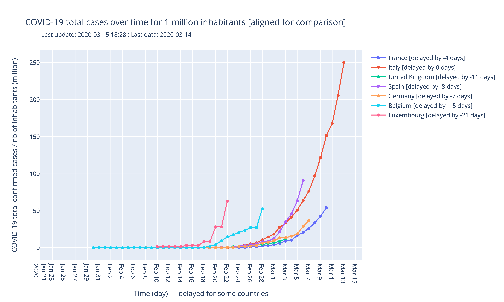
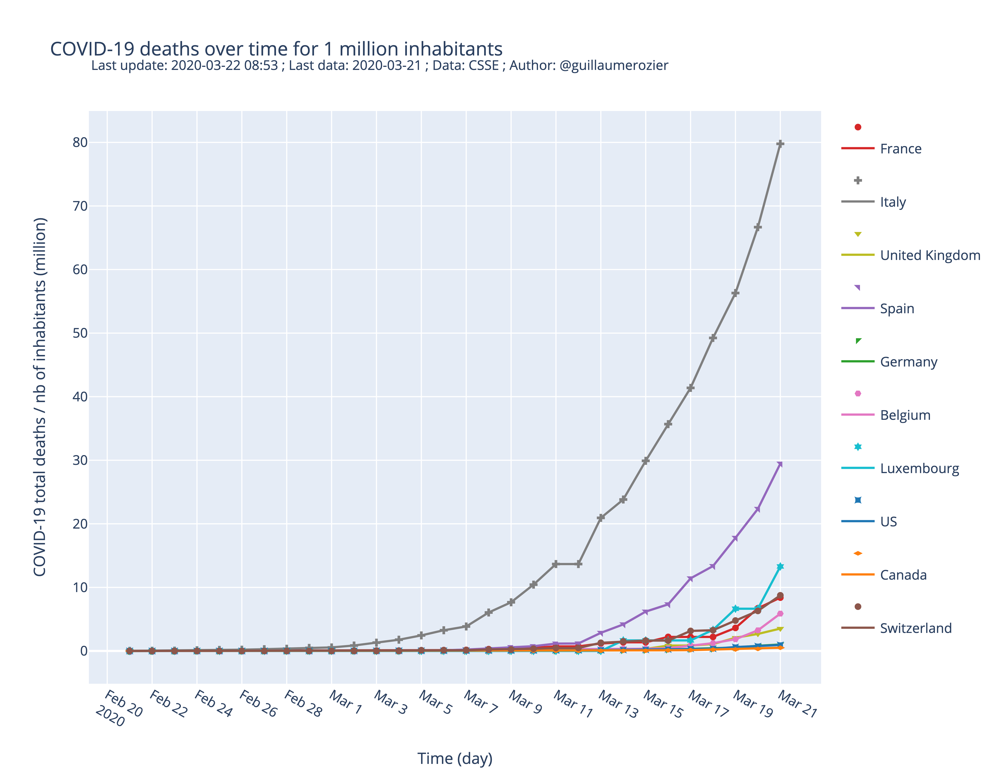
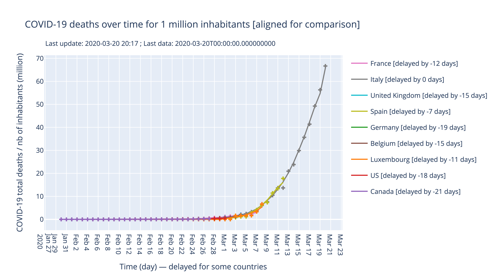

# covid-19: data, charts and interpretations in Europe
I worked on COVID-19 (Coronavirus) to see how it spreads around the world. I built charts and collected data, built dashboards and interpretations...

You can see how the virus spreads in France, Luxembourg, Spain, Belgium, United Kingdom (UK) compared to Italy and China.

## Dashboard
I created a [dashboard](https://plot.ly/dashboard/worldice:14/) where you can find 4 of the charts I generate. It is refreshed every 4 hours.

## Charts

### Total cases for 1 million inhabitants
That's simply the total number of cases over time for each countr divided by the total population of the country.

### Total cases for 1 million inhabitants, aligned
Same chart, but every curve is aligned with Italy. That's an easier way to compare how fast the curves grow.  

### Total deaths for 1 million inhabitants
That's simply the total number of deaths over time for each countr divided by the total population of the country.

### Total deaths for 1 million inhabitants, aligned
Same chart, but every curve is aligned with Italy. That's an easier way to compare how fast the curves grow.  

## Data
You can find 2 datasets:
- Data downloaded from (). Data come from WHO (World Health Organization).
- Personal data.

The two dataset are then merged into a more complete dataset.
