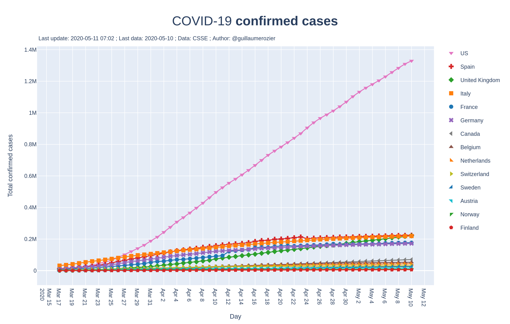
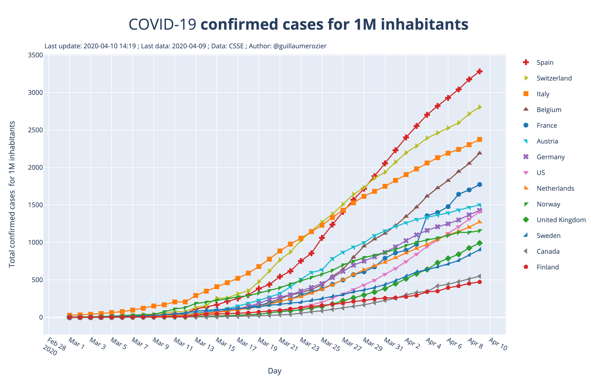
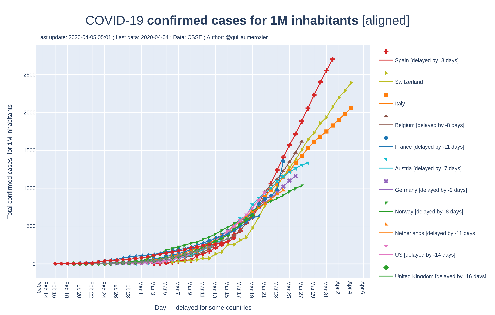
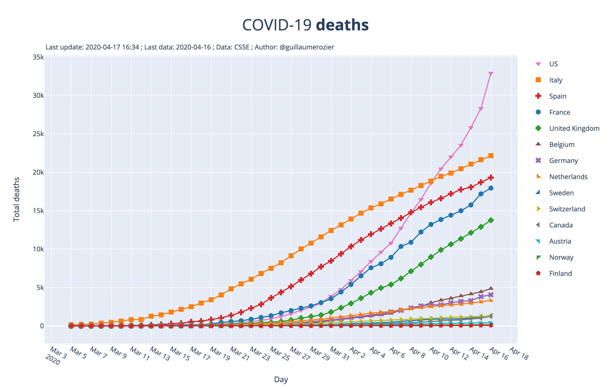
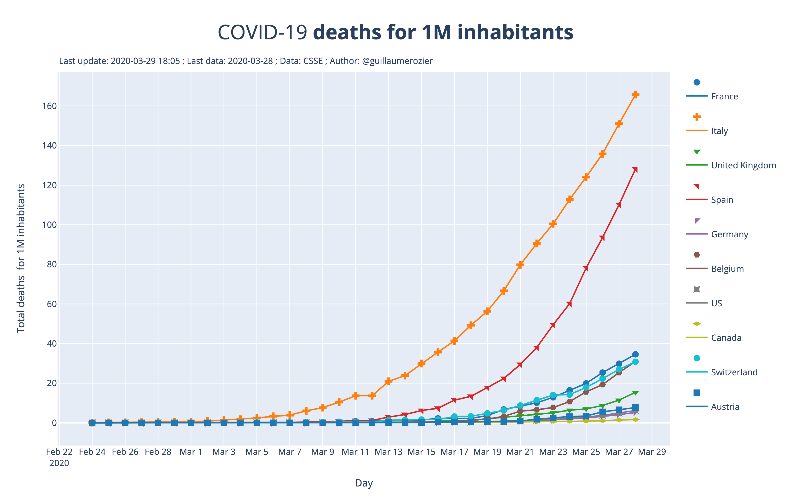
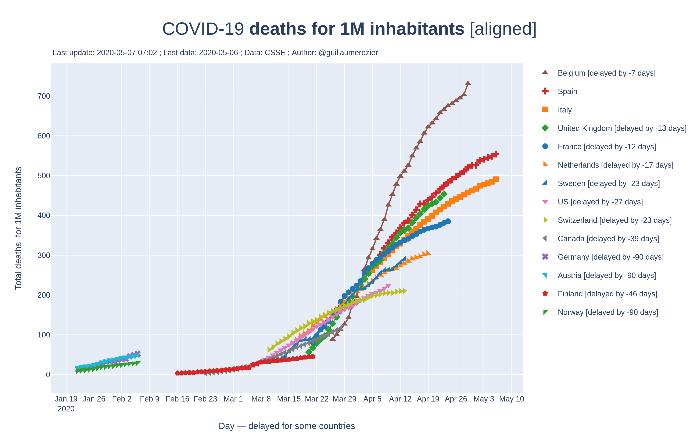
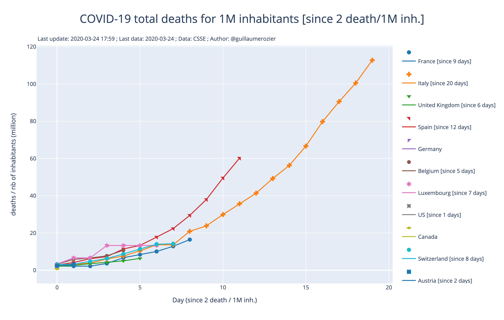
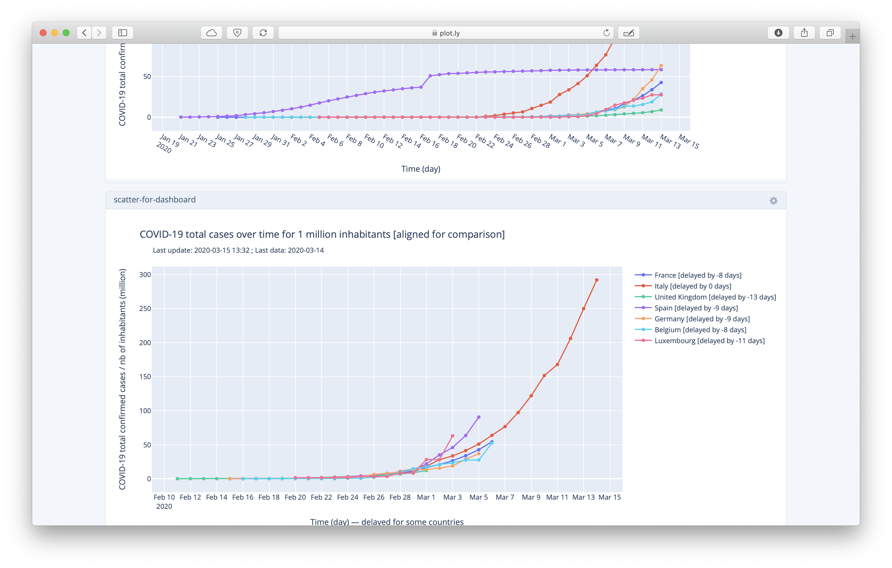

# COVID-19: data, charts and interpretations
You can find on this repository many charts and data about Coronavirus (COVID-19) disease, especially in Europe. Most of data come from CSSE, but I also add data of my own to have up-to-date data.

# All charts
Below are all the charts done. You can download the `PNG` file by clicking on the PNG link for each chart. You will soon be able to access and download interactive HTML charts.

## Confirmed cases of COVID-19

1. **[PNG](https://raw.githubusercontent.com/rozierguillaume/covid-19/master/images/charts/cases.png)** • **Confirmed cases over time**.
This chart represents the total number of confirmed cases of COVID-19 against time, in days.
***

2. **[PNG](https://raw.githubusercontent.com/rozierguillaume/covid-19/master/images/charts/cases_since.png)** • **Confirmed cases over time [since]**.
Same as 1., but each country is displayed from the day a certain threshold has been reached. This makes it possible to compare the recent increase in the number of cases between countries.
***

3. **[PNG](https://raw.githubusercontent.com/rozierguillaume/covid-19/master/images/charts/cases_per_1m_inhabitant.png)** | **Confirmed cases for 1 million inhabitants over time**.
Same as 1. but the number of cases is divided by the population of each country. So the plotted data is the number of confirmed cases for 1 million inhabitants.
***

4. **[PNG](https://raw.githubusercontent.com/rozierguillaume/covid-19/master/images/charts/cases_per_1m_inhabitant_aligned.png)** • **Confirmed cases for 1 million inhabitants over time [aligned]**.
Same as 3., but each curve is aligned on Italy using the Least Squares method. It is easier to compare the progression of each curve.
***

5. **[PNG](https://raw.githubusercontent.com/rozierguillaume/covid-19/master/images/charts/cases_per_1m_inhabitant_since.png)** | **Confirmed cases for 1 million inhabitants over time [since a treschold]**.
Same as 3., but each country is displayed from the day a certain threshold has been reached. This makes it possible to compare the recent increase in the number of cases between countries.
***

## Deaths of COVID-19

1. **[PNG](https://raw.githubusercontent.com/rozierguillaume/covid-19/master/images/charts/deaths.png) • Deaths over time**.
This chart represents the total number of deaths of COVID-19 against time, in days.
***

2. **[PNG](https://raw.githubusercontent.com/rozierguillaume/covid-19/master/images/charts/deaths_since.png)** •  **Deaths over time [since a treschold]**.
Same as 1., but each country is displayed from the day a certain threshold has been reached. This makes it possible to compare the recent increase in the number of cases between countries.
***

3. **[PNG](https://raw.githubusercontent.com/rozierguillaume/covid-19/master/images/charts/deaths_per_1m_inhabitant.png)** •  **Deaths for 1 million inhabitants over time**.
Same as 1. but the number of cases is divided by the population of each country. So the plotted data is the number of confirmed cases for 1 million inhabitants.
***

4. **[PNG](https://raw.githubusercontent.com/rozierguillaume/covid-19/master/images/charts/deaths_per_1m_inhabitant_aligned.png)** • **Deaths for 1 million inhabitants over time [aligned]**.
Same as 3., but each curve is aligned on Italy using the Least Squares method. It is easier to compare the progression of each curve.
***

5. **[PNG](https://raw.githubusercontent.com/rozierguillaume/covid-19/master/images/charts/deaths_per_1m_inhabitant_since.png)** • **Deaths for 1 million inhabitants over time [since a treschold]**.
Same as 3., but each country is displayed from the day a certain threshold has been reached. This makes it possible to compare the recent increase in the number of cases between countries.
***

# Main Charts
All charts are listed above. But, here are the main one, so you don't have to download every one.

## Confirmed cases
### Total cases

### Total cases for 1 million inhabitants
That's simply the total number of cases over time for each countr divided by the total population of the country.

### Total cases for 1 million inhabitants, aligned
Same chart, but every curve is aligned with Italy. That's an easier way to compare how fast the curves grow.  

### Total cases for 1 million inhabitants, since "x cases/mill. hab."

## Deaths
### Total deaths

### Total deaths for 1 million inhabitants
That's simply the total number of deaths over time for each countr divided by the total population of the country.

### Total deaths for 1 million inhabitants, aligned
Same chart, but every curve is aligned with Italy. That's an easier way to compare how fast the curves grow.  

### Total deaths for 1 million inhabitants, since "x deaths/mill. hab."

## Dashboard (deprecated)
I will do a better one soon...
I created a [dashboard](https://plot.ly/dashboard/worldice:14/) where you can find 4 of the charts I generate. It is refreshed every 4 hours.

## Data
You can find 2 datasets:
- Data downloaded from [CSSE](https://github.com/CSSEGISandData/COVID-19). Data come from WHO (World Health Organization).
- Personal data (added manually).

The two dataset are then merged into a more complete dataset.
