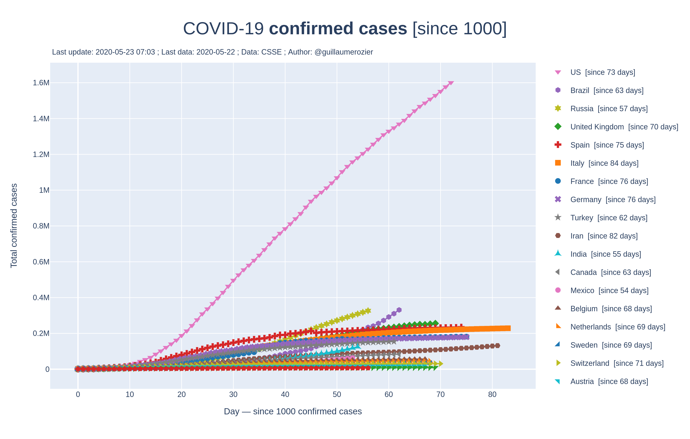
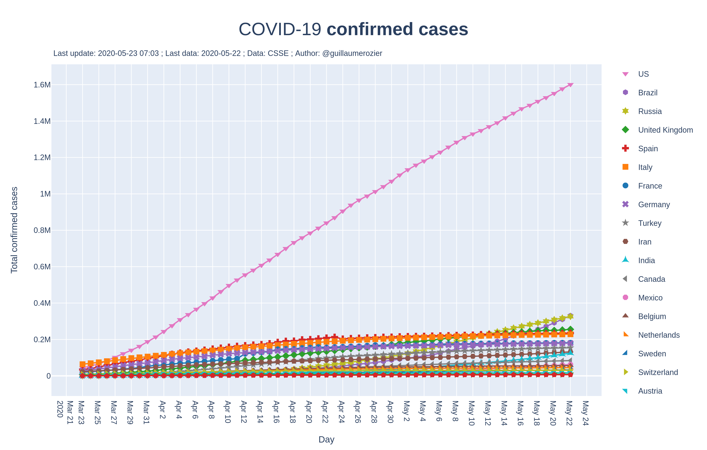
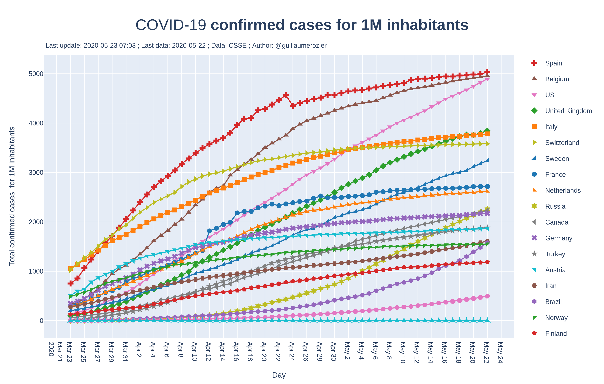
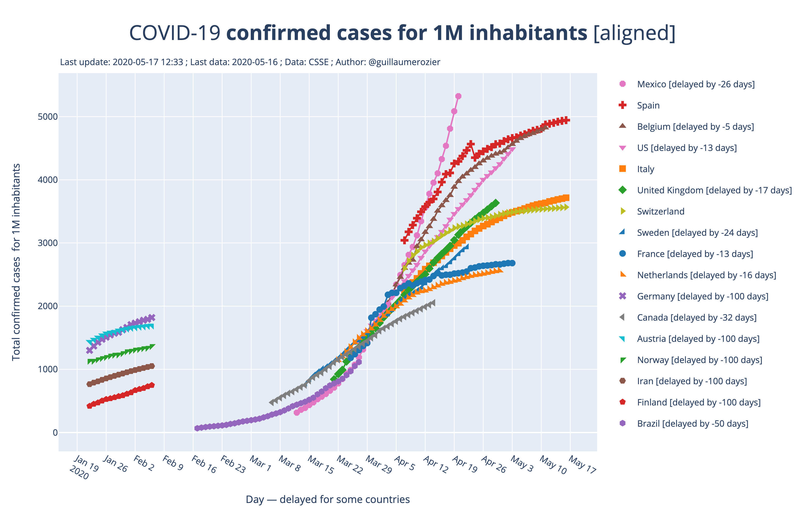
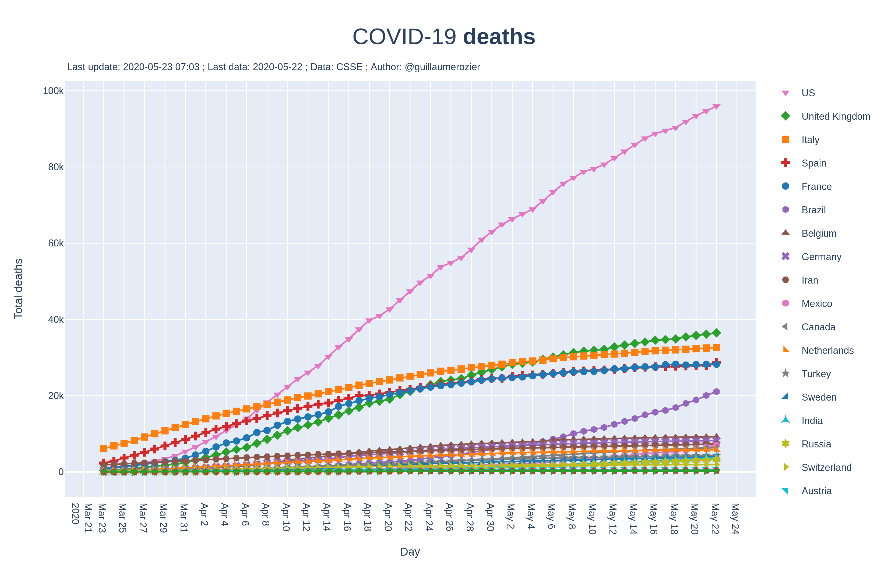
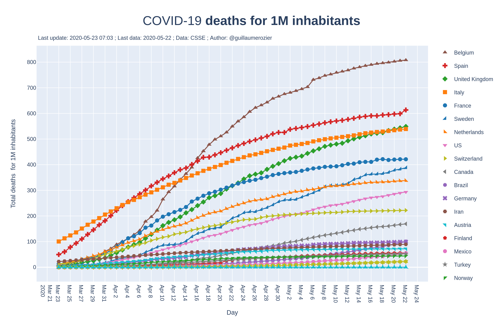
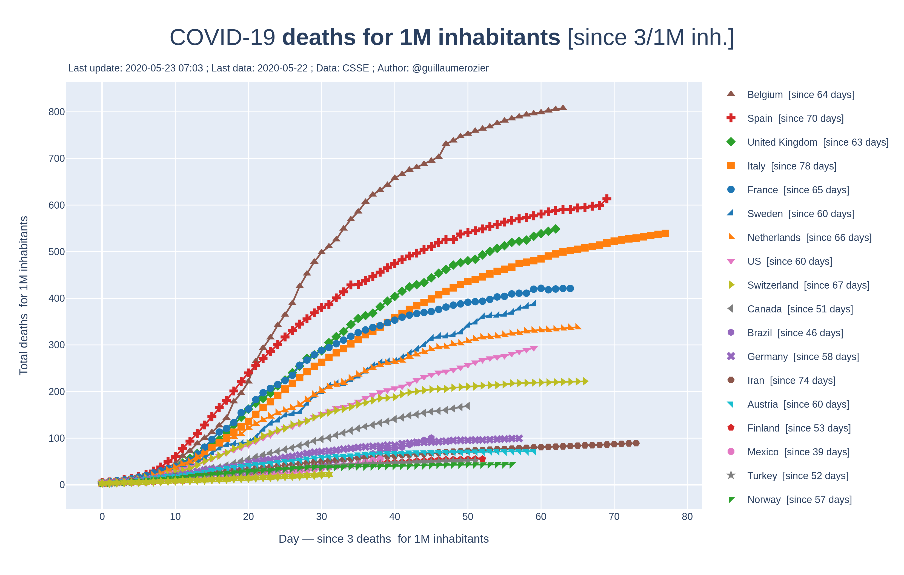

# COVID-19: data, statistics and charts
You can find on this repository many charts and data about Coronavirus (COVID-19) disease, especially in Europe. Most of data come from [CSSE](https://systems.jhu.edu) (Johns Hopkins Center for Systems Science and Engineering), but I also add data of my own to have up-to-date data.

French data come frome [INSEE](https://insee.fr/fr/accueil) (Institut National de la Statistiques et des Études Économiques) and [Santé Publique France](https://www.santepubliquefrance.fr).

For more information and comments in French, you can follow me on Twitter: [@guillaumerozier](http://twitter.com/guillaumerozier).

# France: All Charts
Only few charts are displayed here. You can download every chart in high definition here: 
**[FRENCH CHARTS](https://github.com/rozierguillaume/covid-19/tree/master/images/charts/france).**

<p align="center">
  
   
</p>

<br /><br />

<p align="center">
  
   
</p>

<br /><br />


<p align="center">
  
   
</p>

Please find the other charts here: 
**[French charts](https://github.com/rozierguillaume/covid-19/tree/master/images/charts/france).**

Vous pouvez aussi me suivre sur [Twitter](http://twitter.com/guillaumerozier) pour des interprétations des graphiques.

# World: All Charts
Below are all the charts done. You can download the `PNG` file by clicking on the PNG link for each chart. You will soon be able to access and download interactive HTML charts.

## Confirmed cases of COVID-19


**[PNG (linear scale)](https://raw.githubusercontent.com/rozierguillaume/covid-19/master/images/charts/cases.png)** • **[PNG (log. scale)](https://raw.githubusercontent.com/rozierguillaume/covid-19/master/images/charts/log_yaxis/cases.png)** • **Confirmed cases**.
This chart represents the total number of confirmed cases of COVID-19 against time, in days.

<!---

-->
<!---
**[PNG (linear scale)](https://raw.githubusercontent.com/rozierguillaume/covid-19/master/images/charts/cases_since.png)** • **[PNG (log. scale)](https://raw.githubusercontent.com/rozierguillaume/covid-19/master/images/charts/log_yaxis/cases_since.png)** • **Confirmed cases over time [since]**.
Same as the first one, but each country is displayed from the day a certain threshold has been reached. This makes it possible to compare the recent increase in the number of cases between countries.
-->
<br /><br />


**[PNG (linear scale)](https://raw.githubusercontent.com/rozierguillaume/covid-19/master/images/charts/cases_per_1m_inhabitant.png)** • **[PNG (log. scale)](https://raw.githubusercontent.com/rozierguillaume/covid-19/master/images/charts/log_yaxis/cases_per_1m_inhabitant.png)** • **Confirmed cases for 1M inhabitants**.
Same as the first one, but the number of cases is divided by the population of each country. So the plotted data is the number of confirmed cases for 1 million inhabitants.

<br /><br />


**[PNG (linear scale)](https://raw.githubusercontent.com/rozierguillaume/covid-19/master/images/charts/cases_per_1m_inhabitant_aligned.png)** • **[PNG (log. scale)](https://raw.githubusercontent.com/rozierguillaume/covid-19/master/images/charts/log_yaxis/cases_per_1m_inhabitant_aligned.png)** • **Confirmed cases for 1M inhabitants [aligned]**.
Same as the third one, but each curve is aligned on Italy using the Least Squares method. It is easier to compare the progression of each curve.

<br /><br />


**[PNG (linear scale)](https://raw.githubusercontent.com/rozierguillaume/covid-19/master/images/charts/cases_per_1m_inhabitant_since.png)** • **[PNG (log. scale)](https://raw.githubusercontent.com/rozierguillaume/covid-19/master/images/charts/log_yaxis/cases_per_1m_inhabitant_since.png)** • **Confirmed cases for 1M inhabitants [since a threshold]**.
Same as the third one, but each country is displayed from the day a certain threshold has been reached. This makes it possible to compare the recent increase in the number of cases between countries.

<br /><br />

## Deaths caused by COVID-19


**[PNG (linear scale)](https://raw.githubusercontent.com/rozierguillaume/covid-19/master/images/charts/deaths.png)** • **[PNG (log. scale)](https://raw.githubusercontent.com/rozierguillaume/covid-19/master/images/charts/log_yaxis/deaths.png) • Deaths**.
This chart represents the total number of deaths of COVID-19 against time, in days.

<!---

-->
<!---
**[PNG (linear scale)](https://raw.githubusercontent.com/rozierguillaume/covid-19/master/images/charts/deaths_since.png)** •  **[PNG (log. scale)](https://raw.githubusercontent.com/rozierguillaume/covid-19/master/images/charts/log_yaxis/deaths_since.png)** • **Deaths over time [since a treschold]**.
Same as the first one, but each country is displayed from the day a certain threshold has been reached. This makes it possible to compare the recent increase in the number of cases between countries.
-->
<br /><br />


**[PNG (linear scale)](https://raw.githubusercontent.com/rozierguillaume/covid-19/master/images/charts/deaths_per_1m_inhabitant.png)** •  **[PNG (log. scale)](https://raw.githubusercontent.com/rozierguillaume/covid-19/master/images/charts/log_yaxis/deaths_per_1m_inhabitant.png)** •  **Deaths for 1M inhabitants**.
Same as the first one, but the number of cases is divided by the population of each country. So the plotted data is the number of confirmed cases for 1 million inhabitants.

<br /><br />


**[PNG (linear scale)](https://raw.githubusercontent.com/rozierguillaume/covid-19/master/images/charts/deaths_per_1m_inhabitant_aligned.png)** • **[PNG (log. scale)](https://raw.githubusercontent.com/rozierguillaume/covid-19/master/images/charts/log_yaxis/deaths_per_1m_inhabitant_aligned.png)** • **Deaths for 1M inhabitants [aligned]**.
Same as the third one, but each curve is aligned on Italy using the Least Squares method. It is easier to compare the progression of each curve.

<br /><br />


**[PNG (linear scale)](https://raw.githubusercontent.com/rozierguillaume/covid-19/master/images/charts/deaths_per_1m_inhabitant_since.png)** • **[PNG (log. scale)](https://raw.githubusercontent.com/rozierguillaume/covid-19/master/images/charts/log_yaxis/deaths_per_1m_inhabitant_since.png)** • **Deaths for 1M inhabitants [since a threshold]**.
Same as the third one, but each country is displayed from the day a certain threshold has been reached. This makes it possible to compare the recent increase in the number of cases between countries.

<br /><br />

<!---
# Main Charts
All charts are listed above. But, here are the main one, so you don't have to download every one.

## Confirmed cases
### Total cases


### Total cases for 1 million inhabitants
That's simply the total number of cases over time for each countr divided by the total population of the country.


### Total cases for 1 million inhabitants, aligned
Same chart, but every curve is aligned with Italy. That's an easier way to compare how fast the curves grow.  


### Total cases for 1 million inhabitants, since "x cases/mill. hab."


## Deaths
### Total deaths


### Total deaths for 1 million inhabitants
That's simply the total number of deaths over time for each countr divided by the total population of the country.


### Total deaths for 1 million inhabitants, aligned
Same chart, but every curve is aligned with Italy. That's an easier way to compare how fast the curves grow.  


### Total deaths for 1 million inhabitants, since "x deaths/mill. hab."

-->
# Repository structure

```
covid-19
│   README.md
│   |   covid-19.ipynb  ->  the Jupyter notebook that builds world charts
|   |   covid-19-France.ipynb  ->  the Jupyter notebook that builds world charts
|   |   Please ignore everything else
|
└───data  ->  datasets from CSSE, WHO, INSEE, and more.
│   │   total_cases_csse.csv  ->  CSV file containing total confirmed cases from CSSE.
│   │   total_deaths_csse.csv  ->  CSV file containing total deaths from CSSE.
│   │   total_cases_perso.csv  ->  my own data containing latests confirmed cases (to update charts earlier).
|   |   total_deaths_perso.csv  ->  my own data containing latests deaths (to update charts earlier).
|   |   data_confirmed.csv  ->  exported cases dataset after merging other datasets.
|   |   data_deaths.csv  ->  exported deaths dataset after merging other datasets.
|   |   info_countries.json  ->  information about countries (e.g. population).
|   |   Please ignore everything else
│   
└───images
    └───charts  ->  world charts (linear axis).
        |
        |   * Lot of charts! *
        |
        └───logy_axis  ->  world charts (log axis).
        |
        |   * Exactly the same charts, but whith a log y axis *
        |
        └───france  ->  french charts.
            |
            |  * Lot of charts and gifs! * 
            |
        
```

# Dashboard (deprecated)
I will do a better one soon...
I created a [dashboard](https://plot.ly/dashboard/worldice:14/) where you can find 4 of the charts I generate.
<!--

-->
# Data
You can find 2 datasets:
- Data downloaded from [CSSE](https://github.com/CSSEGISandData/COVID-19). Data come from WHO (World Health Organization).
- [INSEE](https://insee.fr/fr/accueil) (Institut National de la Statistiques et des Études Économiques)
- [Santé Publique France](https://www.santepubliquefrance.fr).
- Personal data (added manually).

The two dataset are then merged into a more complete dataset.
